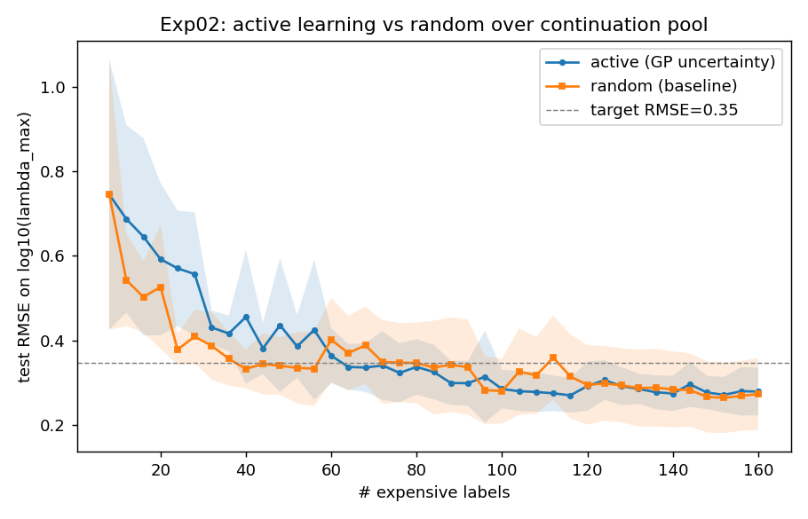

# Track A — a classical stability surrogate for the three-body problem

**Question.** Can a cheap machine-learning surrogate predict the *stability* of a
periodic three-body orbit — its maximum Floquet multiplier `λ_max` — from its
low-dimensional parameters `(a, c, L)`, so that expensive variational
integrations can be avoided or prioritised?

**Short answer.** Yes for *interpolation* (R²≈0.996), with two honest negative
results that bound how the surrogate can be used. This report is deliberately
even-handed about what did and did not work.

---

## Setup

- **Target:** `y = log10(λ_max)`, where `λ_max` is the largest Floquet multiplier
  magnitude of a periodic orbit. `λ_max ≈ 1` ⇒ (marginally) stable; larger ⇒ more
  unstable. Values span **1 → 2.7×10⁵** (log10 0 → 5.4).
- **Features:** `(a, c, L)` plus cheap derived terms (`a·c`, `L−a·c`, `sign c`).
- **Labels:** each label is one variational integration of the 156-component
  extended state (orbit + 12×12 monodromy). Expensive — the whole point of a
  surrogate is to spend fewer of them.
- **Data engine:** *continuation*, not random sampling. Random `(a,c,L)` refine
  to a valid orbit only **~6 %** of the time, and the failures are the expensive
  (near-collision) ones. Continuation walks a known family, emitting one
  on-manifold labelled point per cheap step. Pool: **~2,400 points across 10
  families.**

---

## Result 1 — the surrogate interpolates extremely well

5-fold cross-validation on the full pool (target std = 1.63):

| Model | RMSE on `log10(λ_max)` |
|---|---|
| RandomForest | **0.099** |
| Gaussian Process (isotropic Matérn) | 0.104 |
| HistGradientBoosting | 0.109 |
| GP with per-feature (ARD) length-scales | 0.183 (worse — derived features are collinear) |

RMSE ~0.10 against a spread of 1.63 is **R² ≈ 0.996**. Within the region covered
by known families, `(a,c,L)` is almost fully predictive of stability. As a
*triage* tool — rank/skip candidates before spending integrations — this works.

## Result 2 (negative) — active learning does **not** beat random

The original plan was an active-learning loop: fit a GP, label where it is most
uncertain, repeat, and beat a uniform baseline on labels-to-accuracy.

On a *single* family it looked spectacular (~4× fewer labels). **On the diverse
10-family pool that advantage vanished** — active learning is indistinguishable
from (slightly worse than) random selection:

Why: uncertainty-only acquisition over-samples family *endpoints* (highest
variance, least representative), while random naturally covers the manifold. For
*global* regression accuracy, random is a strong baseline — a known result in the
active-learning literature. The single-curve win was an artifact of one smooth,
dominant family, and the diversity test was built specifically to expose that.

## Result 3 (negative) — extrapolation to novel families fails

Leave-one-family-out (train on 9 families, predict the 10th):

| Held-out family | RandomForest RMSE |
|---|---|
| `seed50`, `seed60` (near training regions) | 0.10 – 0.16 |
| `seed1`, `seed20`, `seed30` | 0.17 – 0.30 |
| `seed10`, `seed40` (complex bifurcations) | 0.45 – 0.98 |
| `jankovic2_b3` (out-of-distribution, `λ_max` to 2.7×10⁵) | **3.18** |
| **mean** | **0.62** |

Extrapolation is 6–10× worse than interpolation, and *worse than a mean-predictor*
for the out-of-distribution family. The surrogate learns the local
`(a,c,L)→stability` law near families it has seen; it does **not** generalise to
genuinely novel topologies. It is triage-grade, not a discovery oracle.

---

## Result 4 — do transferable physics features help extrapolation? (a little)

Before reaching for deep learning, the cheap thing to try is *hand-crafted*
transferable features. Adding energy `E` and period `T` (both available per
point, non-leaky) to the leave-one-family-out test:

| feature set | mean extrapolation RMSE |
|---|---|
| `(a,c,L)` + derived | 0.657 |
| + energy `E` | 0.626 |
| + energy `E`, period `T` | **0.611** |

A real but marginal ~7 % gain, with solid improvements on *near-distribution*
families (seed20 0.20→0.06, seed60 0.26→0.08). But the out-of-distribution
family `jankovic2_b3` stays catastrophic (~3.5). **Hand-engineered scalars help
at the margin and cannot fix novel-topology extrapolation** — which is the
evidence that the real lever is a representation learned from the dynamics, not
more feature engineering.

## Honest conclusion

A cheap classical surrogate predicts three-body orbital stability to R²≈0.996
**within known family regions**, and can triage candidates before spending
expensive integrations. But (a) active learning gives no advantage over random at
these budgets, and (b) the surrogate does not extrapolate to unseen families.

The natural way to attack (b) is a **better representation** — features learned
from the orbit's *dynamics* rather than the raw parameters `(a,c,L)` — which is
the next thread (see the deep-learning / Neural-ODE track).

*Reproduce:* `python -m experiments.exp02_active_vs_random` (AL benchmark),
`python -m experiments.exp03_cross_family` (extrapolation). Data engine:
`data/load_families.py`.
